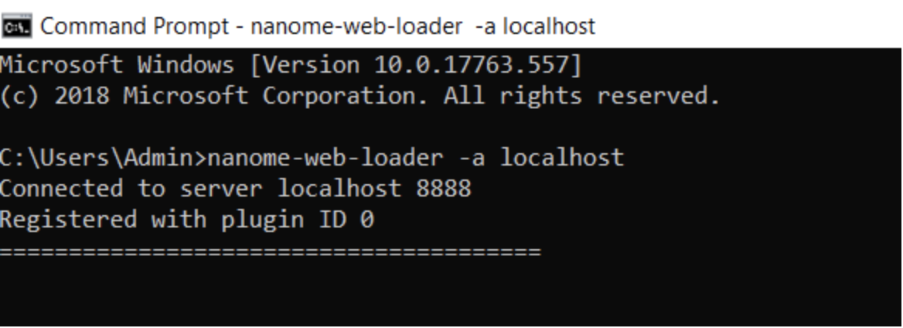
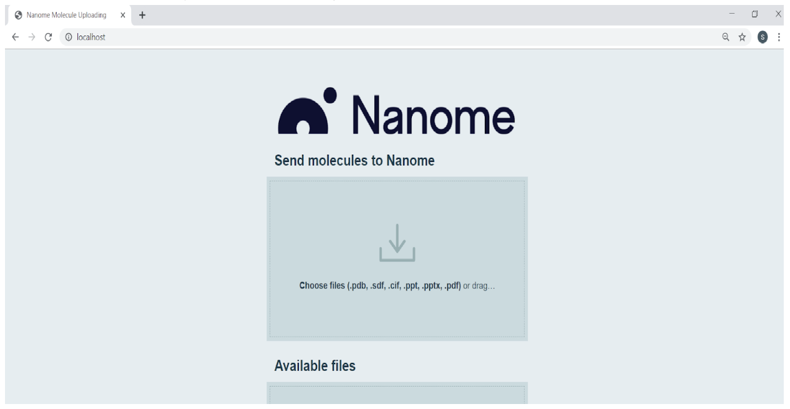
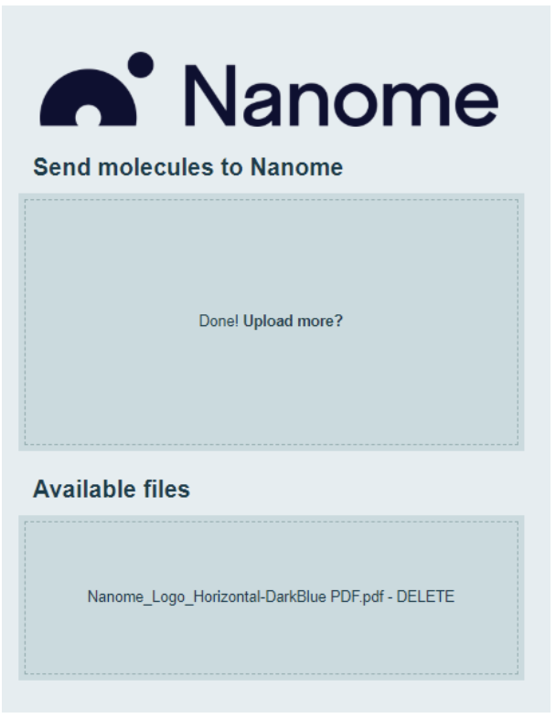
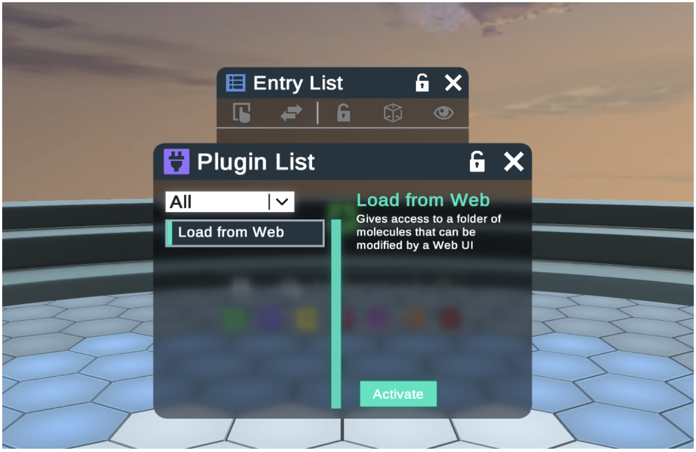

Nanome Plugin API
=================
The Nanome Plugin System is a Python-based API in order to connect external tools into the Nanome Virtual Reality Software Tool for Collaborative Molecular Modeling.

-----------------
Table of Contents
-----------------
.. toctree::
   :maxdepth: 1

   general
   basics
   workspace
   ui
   file
   notification
   

**Overview**

The Nanome Plugin API provides a way to interface and integrate external software with Nanome's molecular modeling VR software. 
Through this API, users can link up external computational such as molecular dynamics or docking software. 
The extended functionality inclues the ability to create new windows inside of the virtual environment and is easily customizable through a drag and drop user interface.

Plugins can be designed and ran from different environments including Windows, Linux, and Mac operating systems depending on the requirements needed from the plugin.

Some examples of plugins that our customers love are:
 - Running and viewing docking results
 - Loading PDFs and PowerPoints
 - Running custom molecular dynamics
 - All of our public plugins are available on our `Github <https://github.com/nanome-ai>`_.

The primary requirements for running plugins is the Nanome Virtual Reality Software and the Nanome Plugin Server (NTS). The Nanome Plugin Server acts as a relay to forward plugin information and processes into the Nanome virtual environment. 

The Nanome Virtual Reality Software can be acquired directly from Nanome or in any of the VR stores here:

 * Oculus Store: https://www.oculus.com/experiences/rift/1873145426039242
 * Viveport: https://www.viveport.com/apps/0a467f78-2ed2-43eb-ada8-9d677d5acf54
 * Steam: https://store.steampowered.com/app/493430/Nanome/

Please contact sales@nanome.ai for the Nanome Plugin Server (NTS.exe)

Using Plugins
--------------

**In order to use a plugin**

*Editing the Config File*

First, you want to locate the Config file (nanome-config.ini) of the Nanome Application in the builds folder.
If you downloaded Nanome through the Oculus store, it will be available here:

C:\Program Files\Oculus\Software\Software\nanome-nanome\Build

Open the nanome-config.ini file in a text editor and scroll down to the section named ‘ Nanome plugin server config’ and change to the following:

Plugin-server-addr = 127.0.0.1
Plugin-server-port = 8888

*Launch a local Plugin Server*

Next, we want to launch the Plugin Server locally. Go ahead and launch the NTS.exe file and a command prompt should open with the server running on port 8888.

.. image:: ../docsAssets/runningNTS.png

Now, we want to check to make sure that the Plugin Server is connected. Go ahead and launch Nanome, then log in using your credentials. Create a room and Start in 2D and click on the Plugins Icon on the bottom of the Entry Menu.

You should see that the NTS is connected and there are no current running plugins. If it says that “No NTS is connected”, that means it is unable to see the Plugin server and it is entered incorrectly on the Config file or in the Admin settings for home.nanome.ai.

Let’s go ahead and run a basic plugin to make sure it is working…

*Installing your first plugin: Nanome Web Loader*

The Nanome Web Loader allows for the distribution of files (PDB, SDF, PDF, PPT) to be drag-and-dropped into a web interface and then available inside of the Nanome VR software.

*Windows
Required dependencies:
 - Python3 & Pip
 - Ghostscript
 - ImageMagick
 - Nanome Library
 - Libre Office
 - Nanome-Loaders Plugin

*Instructions*

1. First, you need to install Python 
 - https://www.python.org/ftp/python/3.7.3/python-3.7.3.exe 
 - Don’t forget to click the checkbox to add Python3 to PATH
2. Open a command prompt
3. Type ``python`` to verify the version is Python 3.0+, then exit()
4. Upgrade your Pip library
 - ``python -m pip install --upgrade pip``
5. Install GhostScript
 - https://github.com/ArtifexSoftware/ghostpdl-downloads/releases/download/gs927/gs927w64.exe
6. Install ImageMagick
 - https://imagemagick.org/download/binaries/ImageMagick-7.0.8-50-Q16-x64-dll.exe
7. Install Libre Office
 - https://www.libreoffice.org/donate/dl/win-x86_64/6.2.4/en-US/LibreOffice_6.2.4_Win_x64.msi
8. Add Libre Office to the PATH environmental variable
 - Search ‘env’ from the Windows Search Bar and click on the ‘Edit System Environment Variables’ in the control panel.

 .. image:: ../docsAssets/search_env.png

 - Click on the ‘Environment Variables’ button

  .. image:: ../docsAssets/find_env.png

 - Click the Edit button for the PATH variable

  .. image:: ../docsAssets/edit_path.png

 - Click the Browse button and select LibraOffice/program in the Program Files

  .. image:: ../docsAssets/browse_path.png

9. Install the latest Nanome Lib through Pip
 - enter ``pip install nanome``
10. Install the Nanome Loaders Plugin
 - Enter ``pip install nanome-loaders``
11. Run the Nanome Loaders’ WebLoader plugin 
 - Enter ``nanome-web-loader -a localhost``
 - The ``-a`` denotes the address of the Plugin Server IP

   
12. You now can open up your browser and go to http://localhost to see the Web Interface

13. Drag and drop a sample PDF into the Web Interface. I have provided one for download here: https://drive.google.com/drive/folders/1JU4jVMH6X_uMjN03mIZCpm9rH62UCDVC?usp=sharing

14. Go ahead and launch Nanome and create a room in 2D mode. Navigate to the Plugins Menu through the button on the Entry Menu to see your plugin populated.

*You can move windows around in 2D mode by right-clicking and dragging the window.
** Hit the escape key to see the controls and make changes to the application

15. Activate the plugin, select your uploaded file and click Load. This will open a new window with your PDF and is resizable.

Additional Basic Examples
-------------------------

*Requirements*

* `Python`_ 3.5.3+ or `Python`_ 2.7.16

.. _Python: https://www.python.org/downloads/

*Dependencies*

None!

**How-to**

*Example Plugin*

Here is a simple plugin example, removing all selected hydrogens in the workspace:

.. literalinclude:: ../../test_plugins/RemoveHydrogens.py
    :language: python

Development
^^^^^^^^^^^^

In order to prepare your development environment and create your own first plugins, follow this link:

.. toctree::
   :maxdepth: 1

   installation
