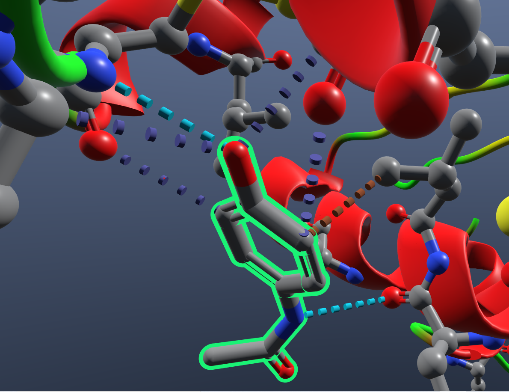
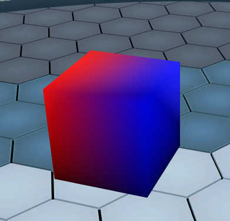

###########
Shapes API
###########

Nanome provides the ability to draw shapes to your workspace.

|pic1| |pic2|

***********
Shape Types
***********
- ``Sphere``
- ``Line``
- ``Label``
- ``Mesh``

***********
Basic Usage
***********

.. code-block:: python

	from nanome.api.shapes import Shape, Sphere
	from nanome.util import Color
	
	sphere = Sphere()
	sphere.radius = 1
	sphere.color = Color.Blue()
	Shape.upload(sphere)

.. code-block:: python

    from nanome.api.shapes import Mesh
    from nanome.util import Color, Vector3

    mesh = Mesh()
    # Create a cube
    mesh.vertices = [0.0, 1.0, 1.0,  0.0, 0.0, 1.0,  1.0, 0.0, 1.0,  1.0, 1.0, 1.0,  0.0, 1.0, 0.0,  0.0, 0.0, 0.0,  1.0, 0.0, 0.0,  1.0, 1.0, 0.0]
    mesh.normals = [-0.408, 0.408, 0.817,  -0.667, -0.667, 0.333,  0.408, -0.408, 0.817,  0.667, 0.667, 0.333,  -0.667, 0.667, -0.333,  -0.408, -0.408, -0.817,  0.667, -0.667, -0.333,  0.408, 0.408, -0.817]
    mesh.triangles = [0,1,2,  0,2,3,  7,6,5,  7,5,4,  3,2,6,  3,6,7,  4,0,3,  4,3,7,  4,5,1,  4,1,0,  1,5,6,  1,6,2]

    mesh.anchors[0].anchor_type = nanome.util.enums.ShapeAnchorType.Workspace
    mesh.anchors[0].position = Vector3(0, 0, 0)
    mesh.color = Color(255, 255, 255, 255)
    mesh.upload()

*******************************
Positioning Shapes with Anchors
*******************************
Shapes are positioned using associated `Anchors`

There are 3 main types of anchors, as enumerated in `nanome.util.enums.ShapeAnchorType`

ShapeAnchorTypes
================

- Workspace:
	- :code:`anchor.local_offset=Vector3`
	- Use anchor.local_offset to position the shape in the workspace
- Complex:
	- :code:`anchor.target=int`. (Complex Index)
	- Set anchor.target to the complex index, and Shape will be centered at the origin of the complex's local coordinate space.
- Atom:
	- :code:`anchor.target=int`.  (Atom Index)
	- Set anchor.target to the atom index, and Shape will be centered on the provided atom.

Anchor Tips
===========

- Lines require 2 anchors.
- If multiple anchors are added to a shape, the shape will be positioned at the center of all the anchors.
- anchor.local_offset and anchor.global_offset can be used to offset the shape from the anchor point.

***************
Shapes.Mesh API
***************

Nanome provides the ability to import 3D meshes to your workspace.

Triangle array is a list of 0-based, positive integers.
Vertices, normals and triangles are mandatory. Since 1.23.2, the normals are not mandatory and can be re-computed in Nanome.

Mesh coloring
=============

There are several ways to color a mesh using the Shape API:

- Using the mesh color (`mesh.color = Color(255, 255, 255, 128)`) will uniformly color the mesh in transparent white.
- Using per-vertex colors (`mesh.colors = [1.0, 1.0, 1.0, 1.0, ...]`) will color the mesh per-vertex (alpha is ignored).
- Using a texture (`mesh.texture_path = 'path/to/img.png'`) will load the texture (jpeg or png format) and map it to the mesh using `mesh.uv`.

Note that the mesh color will blend with the per-vertex colors and the mesh texture.

Since Nanome 1.23.2, transparent meshes are also using textures and per-vertex colors.

As texturing the mesh uses the uv array, the texture will not be mapped if `mesh.uv` is not set.

****************
Example Plugins
****************

Shapes Example
==============

.. code-block:: python

	import nanome
	from nanome.api import structure
	from nanome.api.shapes import Anchor, Label, Line, Shape, Sphere
	from nanome.util import Vector3, enums, Color
	from nanome.util.asyncio import async_callback

	class ShapesExamplePlugin(nanome.AsyncPluginInstance):
		"""Draw two spheres connected by a labeled line."""

		@async_callback
		async def on_run(self):
			radius = 5
			sphere1_position = Vector3(25, 100, 50)
			sphere2_position = Vector3(50, 100, 50)

			# Draw sphere anchored to point in Workspace
			sphere1 = Sphere()
			sphere1.radius = radius
			sphere1.color = Color.Blue()
			anchor1 = sphere1.anchors[0]
			anchor1.anchor_type == enums.ShapeAnchorType.Workspace
			anchor1.local_offset = sphere1_position
			
			# Create atom, and draw sphere anchored to it
			comp = self.add_complex(sphere2_position)
			comp = (await self.add_to_workspace([comp]))[0]
			atom = next(comp.atoms)

			anchor2 = Anchor()
			anchor2.anchor_type = enums.ShapeAnchorType.Atom
			anchor2.target = atom.index
			
			sphere2 = Sphere()
			sphere2.radius = radius
			sphere2.color = Color.Blue()
			sphere2.anchors = [anchor2]

			# Draw line between spheres.
			line = Line()
			line.thickness = 1
			line.dash_distance = .75
			line.color = Color.White()
			line.anchors = [anchor1, anchor2]
			await Shape.upload_multiple([sphere1, sphere2, line])

			# Lets add a label that's centered on the line.
			line_label = Label()
			line_label.text = 'Label'
			line_label.anchors = line.anchors
			for anchor in line_label.anchors:
				anchor.viewer_offset = Vector3(0, 0, -.1)
			await Shape.upload(line_label)

		def add_complex(self, position):
			"""Add a Complex containing one atom to the workspace."""
			comp = structure.Complex()
			mol = structure.Molecule()
			chain = structure.Chain()
			res = structure.Residue()
			atom = structure.Atom()

			atom.label_text = 'Atom'
			atom.position = position
			res.add_atom(atom)
			chain.add_residue(res)
			mol.add_chain(chain)
			comp.add_molecule(mol)
			comp.name = "Test Complex"
			return comp

	def main():
		title = 'Shapes and Lines Example'
		description = 'Draw some shapes with different anchor types'
		advanced_settings = False
		plugin = nanome.Plugin(title, description, advanced_settings)
		plugin.set_plugin_class(ShapesExamplePlugin)
		plugin.run()

	if __name__ == '__main__':
		main()

Mesh example
=============

.. code-block:: python

	import nanome
	from nanome.api.shapes import Mesh
	from nanome.util import Color, Vector3
    from nanome.util.asyncio import async_callback

    class MeshExamplePlugin(nanome.AsyncPluginInstance):

        @async_callback
        async def on_run(self):
            mesh = Mesh()
            # Create a cube
            mesh.vertices = [
			0.0, 20.0, 20.0,  0.0, 0.0, 20.0,  20.0, 0.0, 20.0,  20.0, 20.0, 20.0,
			0.0, 20.0, 0.0,  0.0, 0.0, 0.0,  20.0, 0.0, 0.0,  20.0, 20.0, 0.0]
            mesh.normals = [
			-0.408, 0.408, 0.817,  -0.667, -0.667, 0.333,  0.408, -0.408, 0.817,
			0.667, 0.667, 0.333,  -0.667, 0.667, -0.333,  -0.408, -0.408, -0.817, 
			0.667, -0.667, -0.333,  0.408, 0.408, -0.817]
            mesh.triangles = [
			0,1,2, 0,2,3, 7,6,5, 7,5,4, 3,2,6, 3,6,7, 4,0,3, 4,3,7, 4,5,1,
			4,1,0, 1,5,6, 1,6,2]

            mesh.anchors[0].anchor_type = nanome.util.enums.ShapeAnchorType.Workspace
            mesh.anchors[0].position = Vector3(0, 0, 0)
            mesh.color = Color(255, 255, 255, 255)
            mesh.colors = [
				1.0, 0.0, 0.0, 1.0, 1.0, 0.0, 0.0, 1.0, 1.0, 0.0, 0.0, 1.0, 1.0, 0.0,
				0.0, 1.0,0.0, 0.0, 1.0, 1.0, 0.0, 0.0, 1.0, 1.0, 0.0, 0.0, 1.0, 1.0,
				0.0, 0.0, 1.0, 1.0]
            mesh.upload()

    def main():
		title = "Mesh Example"
		description = "Create a cube and color it with per-vertex colors"
		advanced_settings = False
        plugin = nanome.Plugin(title, , description, advanced_settings)
        plugin.set_plugin_class(MeshExamplePlugin)
        plugin.run()
    
    if __name__ == '__main__':
        main()