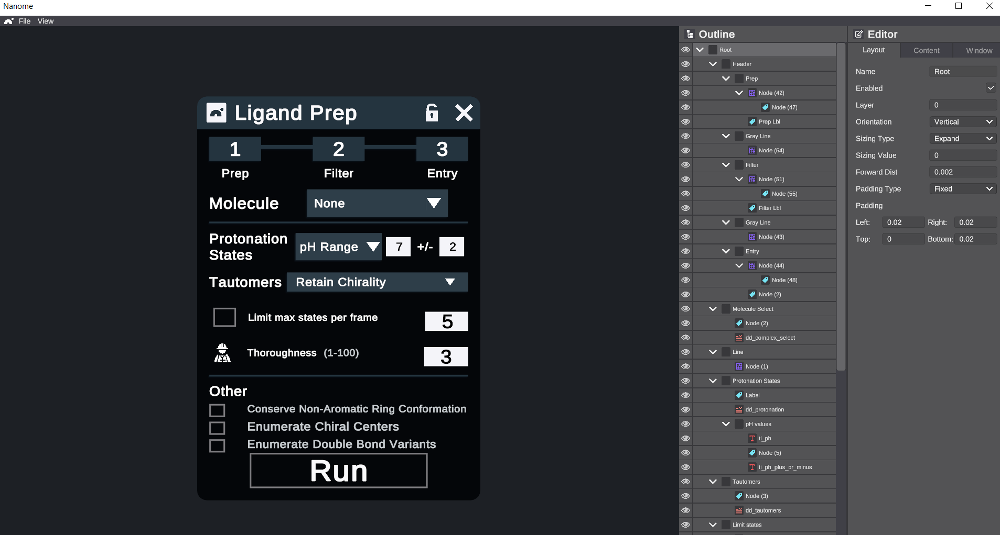

##################
User Interface API
##################

***
API
***

The UI API can be used to create a Menu from scratch, or to interact with any menu or UI element generator built in  Stack Studio.

UI elements are organized like so:

- **Menu** - Contains its size, title, enabled state, etc.
- ---- **Root** - Main Layout Node
- ---------- **Layout** Node - Contains positioning information, orientation, etc.
- ---------------- **Content** - Button/Slider/Text Input/etc.
- ---------------- **Children** Layout Nodes - A layout node can contain other Layout Nodes

A menu hierarchy is created by placing :class:`~nanome.api.ui.layout_node.LayoutNode` under each other, and changing their orientations and sizes.

Currently available UI elements are:

- :class:`~nanome.api.ui.button.Button`
- :class:`~nanome.api.ui.slider.Slider`
- :class:`~nanome.api.ui.label.Label`
- :class:`~nanome.api.ui.text_input.TextInput`
- :class:`~nanome.api.ui.image.Image`
- :class:`~nanome.api.ui.mesh.Mesh`
- :class:`~nanome.api.ui.ui_list.UIList`
- :class:`~nanome.api.ui.dropdown.Dropdown`

***********
StackStudio
***********

StackStudio is a WYSIWYG editor for Menus, making it easier to create UIs for your plugins.
You create your menu, export it as JSON, and import it at runtime in your plugin

Download
--------
- `Windows <'https://nanome.s3-us-west-1.amazonaws.com/installers/StackStudio/StackStudio_v5.2_Windows.zip'>`_ 
- `Mac <'https://nanome.s3-us-west-1.amazonaws.com/installers/StackStudio/StackStudio_v0.5_Mac.zip'>`_

Tips
----
- Save Frequently: there's currently no way to undo changes, so export your JSONs as often as possible.
- For images, you can add a placeholder in StackStudio, but the real image needs to be loaded by the plugin

******************
Z-fighting problem
******************

A known problem, called z-fighting, is the following:

.. image:: z-fighting.png
  :width: 400
  :alt: z-fighting

If you look closely, you will see that the text intersects with its background. This happens when two objects are exactly on the same plan.

To fix this issue, try to set the :attr:`~nanome.api.ui.layout_node.LayoutNode.forward_dist` of your foreground element (here, the text)
