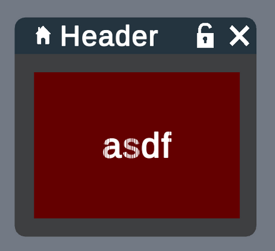

User Interface API
==================

Plugin Menu Creator
^^^^^^^^^^^^^^^^^^^

In order to make menu creation easier, we provide a tool called StackStudio.

.. todo::
    Write how to integrate plugin menu creator menus in a plugin

API
^^^

The UI API can be used to create a Menu from scratch or to interact with any menu or UI element generator by the Plugin Menu Creator.

UI elements are organized like so:

- **Menu** - Contains its size, title, enabled state, etc.
- ---- **Root** - Main Layout Node
- ---------- **Layout** Node - Contains positioning information, orientation, etc.
- ---------------- **Content** - Button/Slider/Text Input/etc.
- ---------------- **Children** Layout Nodes - A layout node can contain other Layout Nodes
- ---------------------- etc.

A menu hierarchy is created by placing :class:`~nanome.api.ui.layout_node.LayoutNode` under each other, and changing their orientations and sizes.

Currently available UI elements are:

- :class:`~nanome.api.ui.button.Button`
- :class:`~nanome.api.ui.slider.Slider`
- :class:`~nanome.api.ui.label.Label`
- :class:`~nanome.api.ui.text_input.TextInput`
- :class:`~nanome.api.ui.image.Image`
- :class:`~nanome.api.ui.mesh.Mesh`
- :class:`~nanome.api.ui.ui_list.UIList`
- :class:`~nanome.api.ui.dropdown.Dropdown`

Following is an example of manual UI creation:

.. literalinclude:: ../../test_plugins/UIPlugin.py
   :language: python

Z-fighting problem
^^^^^^^^^^^^^^^^^^

A known problem, called z-fighting, is the following:

If you look closely, you will see that the text intersects with its background. This happens when two objects are exactly on the same plan.

To fix this issue, try to set the :attr:`~nanome.api.ui.layout_node.LayoutNode.forward_dist` of your foreground element (here, the text)
