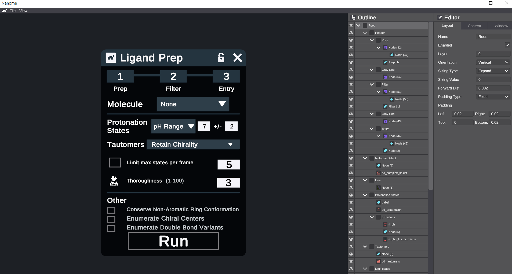
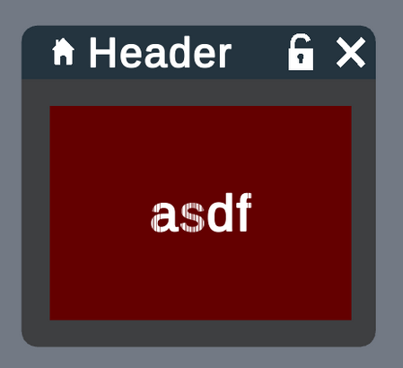

##################
User Interface API
##################

The UI API can be used to create Menus for your Plugins.

Menus can be created using just the lib, or using our WYSIWYG application StackStudio, and imported. (Examples below.)

**************
Hierarchy
**************
UI elements are organized like so:

- **Menu** - Contains its size, title, enabled state, etc.
- ---- **Root** - Main LayoutNode
- ---------- **LayoutNode** - Contains positioning information, orientation, etc.
- ---------------- **Content** - Button/Slider/Text Input/etc.
- ---------------- **Children** LayoutNodes - A layout node can contain other Layout Nodes

A menu hierarchy is created by placing :class:`~nanome.api.ui.layout_node.LayoutNode` under each other, and changing their orientations and sizes.

Currently available UI elements:

- :class:`~nanome.api.ui.button.Button`
- :class:`~nanome.api.ui.dropdown.Dropdown`
- :class:`~nanome.api.ui.image.Image`
- :class:`~nanome.api.ui.label.Label`
- :class:`~nanome.api.ui.loading_bar.LoadingBar`
- :class:`~nanome.api.ui.mesh.Mesh`
- :class:`~nanome.api.ui.slider.Slider`
- :class:`~nanome.api.ui.text_input.TextInput`
- :class:`~nanome.api.ui.ui_list.UIList`

***********
StackStudio
***********

StackStudio is a WYSIWYG editor for Menus, making it easier to create UIs for your plugins.
You create your menu, export it as JSON, and import it to your plugin.

========
Download
========

- `Windows <https://nanome.s3-us-west-1.amazonaws.com/installers/StackStudio/StackStudio_v5.2_Windows.zip>`_ 
- `Mac <https://nanome.s3-us-west-1.amazonaws.com/installers/StackStudio/StackStudio_v0.5_Mac.zip>`_

====
Tips
====
- Save Frequently: there's currently no way to undo changes, so export your JSONs as often as possible.
- For images, you can add a placeholder in StackStudio, and set the size and dimensions. However, the real image needs to be loaded by the plugin

==================
Keyboard Shortcuts
==================
- **1 / 2 / 3** - switch between tabs on right panel
- **up / down** - navigate layout node hierarchy
- **left / right** - jump to parent / child node
- **ctrl up / ctrl down** - move node up / down within parent node
- **ctrl left** - unparent node from parent
- **ctrl right** - parent node to node above
- **ctrl c** - copy node and children
- **ctrl x** - cut node and children
- **ctrl v** - paste copied node and children
- **ctrl s** - Export JSON
- **ctrl o** - Select JSON File to import
- **c** - quick add content to selected node
- **n** - create child node
- **delete / backspace** - delete selected node 

******************
Z-fighting problem
******************

A known problem, called z-fighting, is the following:

If you look closely, you will see that the text intersects with its background. This happens when two objects are exactly on the same plane.

To fix this issue, try to set the :attr:`~nanome.api.ui.layout_node.LayoutNode.forward_dist` of your foreground element (here, the text)

***********
Examples
***********

==================================
Importing a Menu from JSON
==================================

 We've found over time that creating a wrapper class around the ``Menu`` class is a good idea.

 The wrapper class can hold attributes referencing UI elements, callback functions, 

.. code-block:: python

  import nanome
  import os

  # Path to json exported from StackStudio
  BASE_DIR = os.path.dirname(os.path.realpath(__file__))
  MENU_JSON = os.path.join(BASE_DIR, 'menu.json')
  IMAGE_PATH = os.path.join(BASE_DIR, 'sample_image.png')

  class ExampleMenu:
    """Wrapper for interacting with nanome.ui.Menu object."""

    def __init__(self, plugin):
      """Initialize the menu.

      :param plugin: PluginInstance
      """
      self.plugin = plugin

      # This is where we render the JSON into a Menu object
      self._menu = nanome.ui.Menu.io.from_json(MENU_JSON)

      # Store button from menu as attribute, and register callback
      self.example_btn = self._menu.root.find_node('LayoutNode with Button').get_content()
      self.example_btn.register_pressed_callback(self.on_btn_pressed)

      # Add image to LayoutNode
      self.ln_image = self._menu.root.find_node('ImageLayoutNode')
      self.ln_image.add_new_image(IMAGE_PATH)

    def enable(self):
      self._menu.enabled = True
      self.plugin.update_menu(self._menu)

    def on_btn_pressed(self, btn):
      msg = "Hello Nanome!"
      self.send_notification(nanome.util.enums.NotificationTypes.success, msg)

  class HelloNanomePlugin(nanome.PluginInstance):
    """Render an example menu that has a clickable button."""
      
    def start(self):
      self.menu = ExampleMenu(self)

    def on_run(self):
      self.menu.enable()

===================================================
Creating a Menu from scratch (No JSON)
===================================================
You can alternatively build a menu up using a function similar to below.

.. code-block:: python

  from nanome.api.ui import Menu

  def create_menu(self):
    menu = Menu()
    menu.title = 'Example Menu'
    menu.width = 1
    menu.height = 1

    # Add a label that says "Hello Nanome"
    msg = 'Hello Nanome!'
    node = menu.root.create_child_node()
    node.add_new_label(msg)

    # Add a button that says "Click Me!"
    ln_button = menu.root.create_child_node()
    btn = ln_button.add_new_button('Click Me!')
    btn.register_pressed_callback(self.on_btn_pressed)
    return menu

========================
In Depth API usage
========================

A fun example of how to set up callback functions for most UI Elements.

.. literalinclude:: ../../test_plugins/UIPlugin.py
   :language: python
